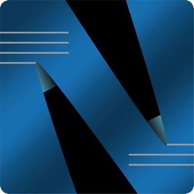

   <a href="/">
      
m.n.m
</a>
   
   
   
   <a href="/faq.html">FAQ</a> &bull;
   <a href="/demo.html">Demo</a> &bull;
   <a href="/#download--startup">Download</a> &bull;
   <a href="/#got-an-issue-idea-insight">Contact</a>

### TMTP: site-specific Internet messaging

<!--div style="margin:4em 2px 1.5em 22px; width:300px; max-width:45%; float:right; clear:both; text-align:center;">
   <a href="https://www.patreon.com/networkimprov" title="Support mnm on Patreon"
      style="border-radius:9999px; padding:0.6em 1em; background-color:#ff424d; color:#fff; text-decoration:none; white-space:nowrap;"
      >Become a patron</a>
</div-->

Internet sites lack a way to directly message their customers/members.
Email (SMTP etc) is insecure & indirect, typically transiting multiple third-party hosts between sender & recipient.
(Email also has other painful problems!)
Text messaging (SMS) is expensive.
Many Internet sites patch this gap by building & maintaining custom phone apps&mdash;at great cost.

Fixing this requires a new Internet protocol combining elements of the web and email.
That's TMTP: a simple, site-specific, secure messaging & correspondence protocol.

The __mnm open source project__ implements TMTP, both server and client.
It's applicable to any site that keeps a users list, but especially:

- Organizations that provide essential services. \
Examples: banking, IT/SaaS, telecom, shipping, manufacturing, security.

- Businesses and professionals whose clients dislike the message scanning done by webmail providers. \
Examples: legal affairs, health care, job search, family matters.

As well as letting sites reach customers/members directly & securely, TMTP also benefits end users:

1. It provides a far safer model than email, where you:  
\+ choose the sites where you participate  
\+ select which members of a site can message you  
\+ always know from which site a message originated  
\+ can block anyone with whom you've made contact  
\+ may leave a site and never see traffic from it again  

2. It offers capabilities missing in email, including:  
\+ message formatting &amp; layout via Markdown (aka CommonMark)  
\+ hyperlinks to messages and other threads  
\+ hashtags and private tags  
\+ slide deck layouts  
\+ data-driven charts &amp; graphs  
\+ forms/surveys whose results are collected into tables  
\+ many more features to foster focus, creativity, efficiency, and clarity  

Further reading: &nbsp; [_Frequently Asked Q's_](faq.html) 
&nbsp; &ndash; &nbsp; [TMTP Draft Specification](https://github.com/networkimprov/mnm/blob/master/Protocol.md)

---
### Status

The [client](https://github.com/networkimprov/mnm-hammer) 
and [server](https://github.com/networkimprov/mnm) 
are open source, subject to the terms of the 
[Mozilla Public License, v2.0](http://mozilla.org/MPL/2.0/){:target="_blank"}.

Major portions of this page and [the _FAQ_](faq.html) were rewritten in April 2022.

The mnm client app has had nine preview releases since April 2019. 
It runs on Windows, MacOS, and Linux; ports to Android and iOS are planned. 
Its UI appears in a web browser, and is tested with Chrome & Firefox. 
It stores all data on the user's machine, and can replicate the data to other devices. 
It includes complete docs, and a tour for first-time users. 
See also the [release history](https://github.com/networkimprov/mnm-hammer/releases) 
and [Readme](https://github.com/networkimprov/mnm-hammer/blob/master/README.md). 

The mnm TMTP server has been deployed on a host in a public datacenter for testing use since early 2019. 
It runs on Linux; ports to FreeBSD, Windows, and MacOS are planned. 
It has no runtime dependencies. 
It does not yet support restrictions on who may create accounts. 
See also the [release history](https://github.com/networkimprov/mnm/releases) 
and [Readme](https://github.com/networkimprov/mnm/blob/master/README.md). 

---
### Got an issue, idea, insight?

To submit a question, observation, feature request, or bug report, please open or comment on an issue:

- [Re the TMTP protocol](https://github.com/networkimprov/mnm/issues)
- [Re the mnm client app](https://github.com/networkimprov/mnm-hammer/issues)
- [Re the mnm TMTP server](https://github.com/networkimprov/mnm/issues) \
  &nbsp;
- Support [mnm on Patreon](https://www.patreon.com/networkimprov)
- Follow mnm on: 
[Twitter](https://twitter.com/mnmnotmail) &ndash; 
[DEV](https://dev.to/mnmnotmail) &ndash; 
[Facebook](https://facebook.com/mnmnotmail)
- Message the author: [@mnmnotmail](https://twitter.com/mnmnotmail) _at_ Twitter &ndash; mnm _at_ networkimprov &bull; net

---
### Download & Startup

You'll need an invitation to a TMTP service. 
To run your own service, [set up the mnm TMTP server](https://github.com/networkimprov/mnm/blob/master/README.md#quick-start).

You'll need Firefox or Chrome. (I strongly endorse [Firefox](https://www.mozilla.org/en-US/firefox/){:target="_blank"} :-)

Windows
MacOS
Linux

1. Download & save  
a) Click [mnm-app-windows-amd64-v0.9.0.zip](https://github.com/networkimprov/mnm-hammer/releases/download/v0.9.0/mnm-app-windows-amd64-v0.9.0.zip).  
b) In the browser downloads list, find the above file and click "Open File".  
c) Drag the item `mnm-app-v0.9.0` to the `Downloads` folder in the left-hand pane.

1. If a previous version is running  
a) Go to its log window and press _Ctrl-C_ and then _Y_ to stop it.

1. Start app  
a) Open the `mnm-app-v0.9.0` folder now in `Downloads`, and double-click `App` (aka `App.cmd`).  
b) You'll see a notice, either  
b.1) "Windows protected your PC..." Click "More info" and then "Run anyway".  
b.2) "The publisher could not be verified..." Click "Run".  
c) You'll see a system notice, "Do you want to allow ...?" Click "Yes".  
+&nbsp; You'll see the mnm log window.  
+&nbsp; If you have a previous version in `Downloads`, it will offer to update it.  
+&nbsp; If the app fails, it will offer to restart it.  
+&nbsp; To stop the app, press _Ctrl-C_ and then _Y_ (closes the window).

1. Connect Firefox or Chrome  
a) Right-click [localhost:8123](http://localhost:8123/), and select "Open link in new tab".  
+&nbsp; You'll see the landing page, with a tour.

1. Download & save  
Note: MacOS 11 will be supported beginning in Feb 2021.  
a) Click [mnm-app-macos-amd64-v0.9.0.tgz](https://github.com/networkimprov/mnm-hammer/releases/download/v0.9.0/mnm-app-macos-amd64-v0.9.0.tgz).  
b) In the browser downloads list, find the file above and click "Open File".

1. If a previous version is running  
a) Go to its log window and press _Ctrl-C_ to stop it, then close the window.

1. Start app  
a) Open the `mnm-app-v0.9.0` folder now in `Downloads`, Ctrl-click on `App`, and select "Open".  
b) You'll see a notice, "_App_ is a Unix application..." Click "Open" (if possible).  
c) For MacOS 10.15+ (Catalina), read "How to open an app that hasn't been notarized..." on [Apple Support](https://support.apple.com/en-us/HT202491){:target="_blank"}.  
+&nbsp; You'll see the mnm log window.  
+&nbsp; If you have a previous version in `Downloads`, it will offer to update it.  
+&nbsp; If the app fails, it will offer to restart it.  
+&nbsp; To stop the app, press _Ctrl-C_, then close the window.

1. Connect Firefox or Chrome  
a) Ctrl-click (or two-finger tap) [localhost:8123](http://localhost:8123/), and select "Open link in new tab".  
+&nbsp; You'll see the landing page, with a tour.

1. Download & save  
a) Click [mnm-app-linux-amd64-v0.9.0.tgz](https://github.com/networkimprov/mnm-hammer/releases/download/v0.9.0/mnm-app-linux-amd64-v0.9.0.tgz).  
b) Extract the downloaded file, e.g. `tar xzf mnm-app-linux-amd64-v0.9.0.tgz`

1. If a previous version is running  
a) Go to its log window and press _Ctrl-C_ to stop it.

1. Start app  
a) Open the extracted `mnm-app-v0.9.0` folder, and double-click `App`.  
+&nbsp; You'll see the mnm log window.  
+&nbsp; If you have a previous version in the parent folder, it will offer to update it.  
+&nbsp; If the app fails, it will offer to restart it.  
+&nbsp; To stop the app, press _Ctrl-C_ (closes the window).

1. Connect Firefox or Chrome  
a) Right-click [localhost:8123](http://localhost:8123/), and select "Open link in new tab".  
+&nbsp; You'll see the landing page, with a tour.

---
### Installation Notes

On Windows, the app needs Administrator privileges to create symlinks and configure the firewall. 
`App.cmd` creates the firewall configuration. To inspect it, run:  
`netsh advfirewall firewall show rule name=mnm-hammer verbose`

To start the app using a different TCP port, run:  
MacOS & Linux (as any user): `./mnm-hammer -http :8123`  
Windows (as administrator): `mnm-hammer.exe -http :8123`

Updating from a previous version moves the folder `mnm-app-v0.X.0/store` to the new version, 
and leaves the previous version otherwise untouched. 
Launching `App.cmd` or `App` in the previous version will offer to update to it, 
moving the `store` folder back again (not recommended).

---
### Credits

The mnm app and TMTP server are written in
<a target="_blank" href="https://golang.org/">Go</a>.
The app also depends on
<a target="_blank" href="https://github.com/blevesearch/bleve">Couchbase-sponsored Bleve</a>, and
<a target="_blank" href="https://github.com/gorilla/websocket">Gorilla Websocket</a>.
The server also depends on
<a target="_blank" href="https://github.com/beevik/ntp">Brett Vickers' NTP client</a>.

The browser-based UI depends on
<a target="_blank" href="https://vuejs.org/">Vue.js</a> for HTML templates and components,
<a target="_blank" href="https://getuikit.com/">UIkit</a> for icons,
<a target="_blank" href="https://github.com/markdown-it/markdown-it">markdown-it</a>
for Markdown rendering,
<a target="_blank" href="https://github.com/moment/luxon">Luxon</a> for Date/Time formatting, and
<a target="_blank" href="https://github.com/vue-generators/vue-form-generator">vue-form-generator</a>
for the Blank Forms feature.

mnm is always tested first with
<a target="_blank" href="https://www.mozilla.org/">Mozilla Firefox</a>,
and the author frequently turns to the
<a target="_blank" href="https://developer.mozilla.org/">MDN web docs</a>.
Development of mnm is managed with
<a target="_blank" href="https://git-scm.com/">Git</a>.

The logo is by
<a target="_blank" href="https://david-gilmore.com/portfolio/">David Gilmore</a>.

Robin Eng tested the preview releases at length.

Copyright &copy; 2020 Liam Breck

